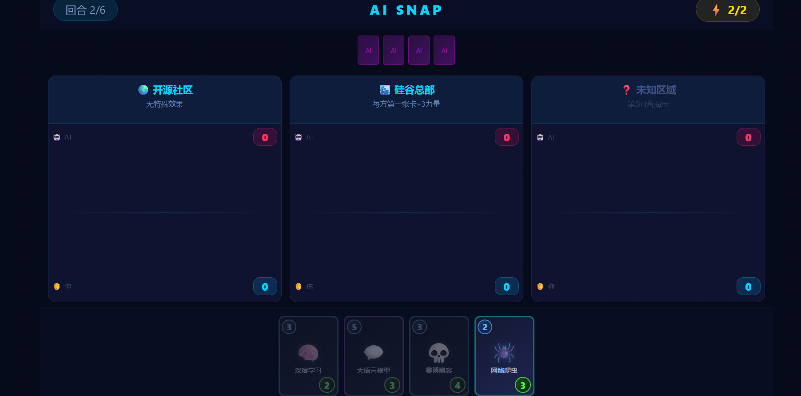

# AI SNAP - 智能对决

一款类似漫威终极逆转（Marvel Snap）的 AI 主题卡牌对战游戏，纯前端实现，打开即玩。

## 游戏截图

<!-- 在此处添加游戏截图，将图片放入项目目录后替换下方路径 -->

## 游戏简介

- 🃏 **12 张科技主题卡牌**：数据节点、神经网络、量子计算机、超级智能等
- 🗺️ **3 个战场位置**：每局随机从 8 个特色场地中抽取，每个场地拥有独特效果
- ⚡ **6 回合制**：每回合能量递增，策略性出牌
- 🤖 **AI 对战**：内置 AI 对手，控制更多位置即可获胜

## 如何启动

1. 双击 `启动游戏.bat` 启动本地服务器
2. 或直接在浏览器中打开 `index.html`

## 卡牌一览

| 费用 | 名称 | 力量 | 技能 |
|------|------|------|------|
| 1 | 🔗 数据节点 | 2 | 基础AI计算单元 |
| 1 | ⚡ 智能算法 | 1 | 每回合开始时+1力量 |
| 2 | 🕷️ 网络爬虫 | 3 | 出牌时抽一张牌 |
| 2 | 🛡️ 防火墙 | 4 | 数字防线，坚不可摧 |
| 3 | 🧠 深度学习 | 2 | 此位置友方每张卡+2力量 |
| 3 | 🌐 神经网络 | 5 | 相邻位置友方卡牌各+1力量 |
| 3 | 💀 赛博黑客 | 4 | 随机敌方卡-3力量 |
| 4 | ☁️ 云计算集群 | 6 | 强大的分布式算力 |
| 4 | 🎯 强化学习 | 3 | 若正在输掉此位置，+5力量 |
| 5 | 💬 大语言模型 | 3 | 此位置友方卡牌力量翻倍 |
| 5 | ⚛️ 量子计算机 | 8 | 50%概率力量翻倍，50%概率-5 |
| 6 | 👁️ 超级智能 | 10 | 摧毁此位置所有力量≤3的敌方卡 |

## 战场位置

| 位置 | 效果 |
|------|------|
| 🏢 中央数据中心 | 所有卡牌+1力量 |
| 🕶️ 暗网黑市 | 双方卡牌隐藏至游戏结束 |
| 🏙️ 硅谷总部 | 每方第一张卡+3力量 |
| 🔬 量子实验室 | 费用≥4的卡牌+3力量 |
| 🌍 开源社区 | 无特殊效果 |
| ⛏️ 算力矿场 | 拥有更多卡牌的一方额外+4 |
| 🏭 芯片工厂 | 1-2费卡牌+3力量 |
| 🌌 元宇宙空间 | 力量最大的卡额外+3 |

## 技术栈

- 纯 HTML / CSS / JavaScript，无任何第三方依赖
- 单文件实现，零构建配置
