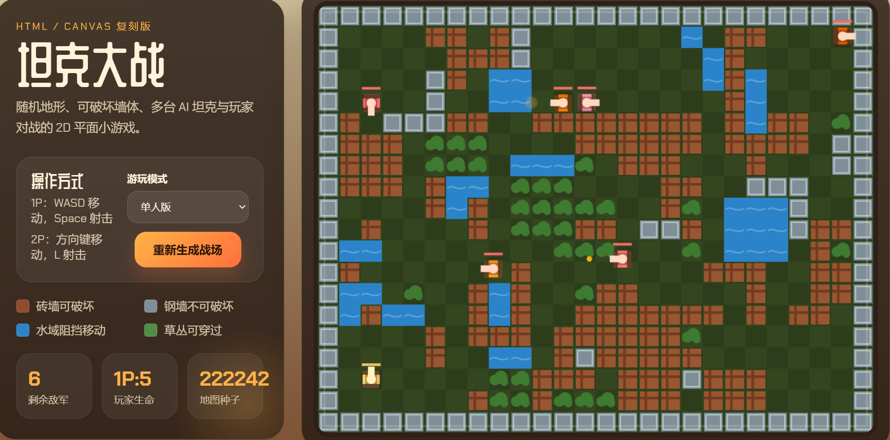

# 坦克大战 Tank World

一个基于 HTML、CSS 和 Canvas 实现的 2D 坦克对战小游戏。

项目包含随机生成地形、可破坏砖墙、不可破坏钢墙、水域阻挡、草丛掩体，以及单人 / 双人两种游玩模式，适合直接作为前端小游戏练习项目或 Canvas 入门示例。

## 项目预览


### 首页与游戏主界面





## 功能特点

- 基于 Canvas 渲染的 2D 坦克战斗场景
- 随机地图生成，每次重新开始都会生成不同战场
- 砖墙可被子弹摧毁，钢墙不可破坏
- 水域会阻挡坦克和子弹路径
- 草丛可穿过，用于增加地图层次感
- 支持单人模式和本地双人模式
- 敌方 AI 会自动巡逻、追踪并寻找射击角度
- 游戏内展示剩余敌军、玩家生命值和地图种子

## 技术栈

- HTML5
- CSS3
- JavaScript
- Canvas API

## 项目结构

```text
tank_world/
├─ index.html      # 页面结构与游戏 UI
├─ styles.css      # 页面样式与界面视觉设计
├─ game.js         # 游戏核心逻辑、渲染与交互
└─ assets/
   └─ screenshots/ # README 使用的项目截图
```

## 运行方式

这是一个纯前端项目，不依赖后端服务。

### 方式一：直接打开

直接用浏览器打开 `index.html` 即可运行。

### 方式二：使用本地静态服务器

如果你希望以更接近实际部署的方式运行，可以在项目目录下执行：

```bash
python -m http.server 8000
```

然后在浏览器访问：

```text
http://localhost:8000
```

## 操作说明

### 单人模式

- `W / A / S / D`：移动
- `Space`：射击

### 双人模式

- 1P
- `W / A / S / D`：移动
- `Space`：射击

- 2P
- `↑ / ↓ / ← / →`：移动
- `L`：射击

## 游戏规则

- 击毁所有敌方坦克即可获得胜利
- 玩家生命值归零则游戏失败
- 点击“重新生成战场”按钮可重开并生成新地图
- 切换“单人版 / 双人版”后会立即重置当前对局

## 适合学习的内容

这个项目适合作为以下方向的练手示例：

- Canvas 基础绘制
- 前端小游戏架构拆分
- 键盘输入控制
- 碰撞检测
- 简单敌人 AI
- 随机地图生成
- 基于原生 JavaScript 的实时循环更新

## 后续可扩展方向

- 增加关卡系统
- 增加基地守卫机制
- 增加不同类型的敌方坦克
- 增加道具掉落和强化系统
- 增加音效与背景音乐
- 增加开始菜单、暂停菜单和结算页
- 增加移动端适配与触屏控制

## 截图补充说明

你后续只需要把实际运行截图保存为以下文件名之一，README 就会自动显示：

- `assets/screenshots/main-ui.png`
- `assets/screenshots/single-mode.png`
- `assets/screenshots/coop-mode.png`

如果你想替换为自己的命名，也只需要同步修改 README 中对应的图片路径即可。